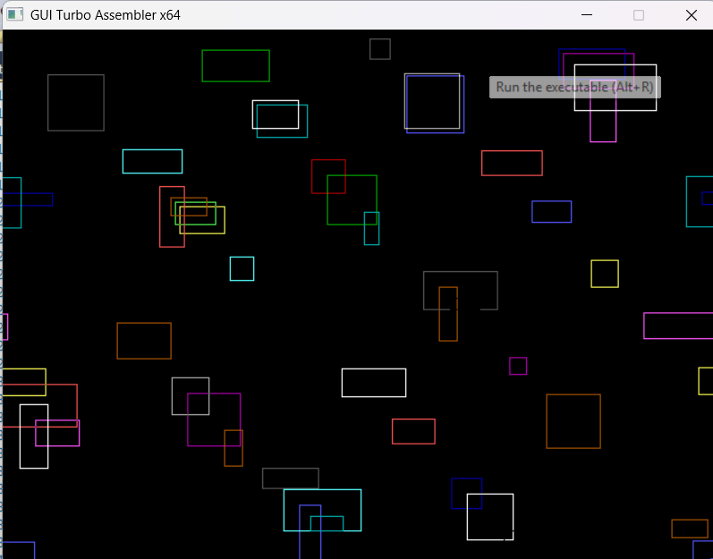
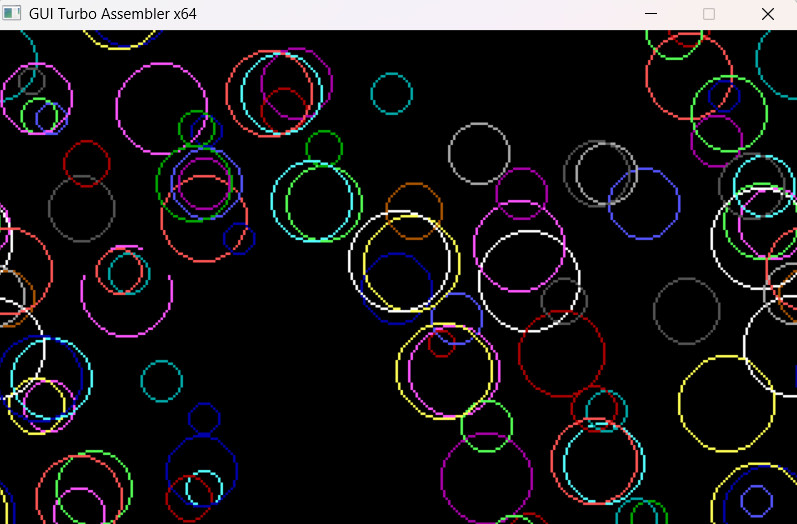
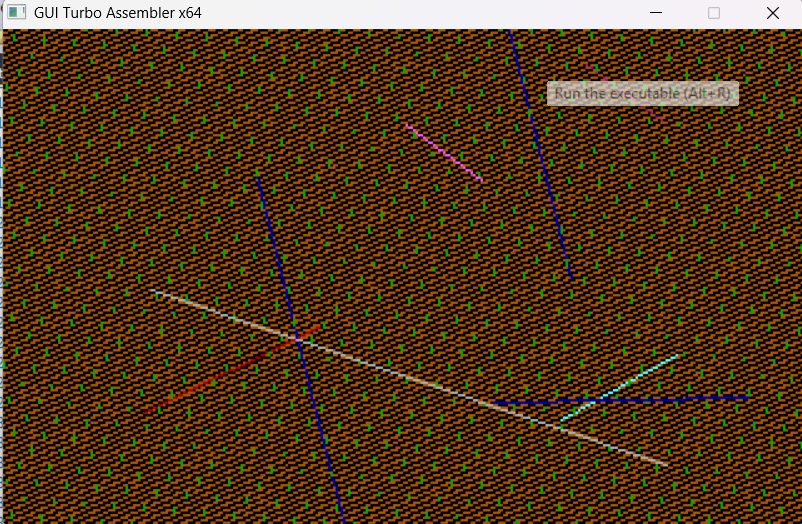

# Proyecto Gráfico en Lenguaje Ensamblador

Este proyecto permite dibujar **rectángulos**, **círculos** y **líneas** de forma **aleatoria** utilizando lenguaje ensamblador. Fue desarrollado como parte de una práctica de programación de bajo nivel, haciendo uso de interrupciones y funciones gráficas.

## 🖥️ Tecnologías utilizadas

- Lenguaje Ensamblador (ASM)
- BIOS/INT 10h (modo de video)
- Ensamblador TASM 
- Emulador GuiTurboAssembler

## 🚀 Funcionalidades

- Dibujo aleatorio de:
  - Rectángulos
  - Círculos
  - Líneas
- Selección del tipo de figura a dibujar mediante menú
- Uso de coordenadas, colores y tamanios generadas aleatoriamente dentro de la pantalla

## 🔧 Cómo compilar y ejecutar

1. Abre GUI Turbo Assembler.
2. Copia los archivos al directorio de trabajo.
3. Ejecuta el archivo que desees:

## 📷 Capturas de pantalla

